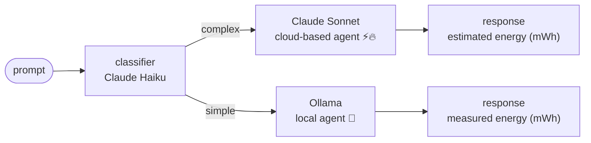

# prompt-router

A terminal-based prompt router that makes the hidden costs of AI use explicit. Prompts are classified by complexity and routed to either a cloud-based model (Claude) or a local model (Ollama). Each response is accompanied by a real or estimated energy figure - measured from the GPU for local inference, and derived from published research for cloud inference.

The goal is not to discourage AI use, but to make its environmental footprint visible at the point of use.

## how it works



The classifier uses a small cloud model (Haiku) to decide the route. Routing decisions and their reasons are shown inline. Hover over the summary line in the TUI to see the full energy breakdown.


### energy methodology

**Local inference (Ollama)**
GPU power is sampled every 500 ms throughout inference via the hardware's power sensor. Energy is calculated as:

```
marginal Wh = (avg_W_during_inference − idle_W) × duration_s / 3600
```

Idle power is subtracted so the figure reflects only what the inference itself cost.

Supported power sensors:
| Hardware | Linux | Windows |
|---|---|---|
| NVIDIA | `nvidia-smi` | `nvidia-smi` |
| AMD | sysfs hwmon -> `amd-smi` -> `rocm-smi` | `amd-smi` |
| Intel | RAPL sysfs | — |

If no sensor is available, the UI reports `power unavailable` rather than crashing.

**Cloud inference (Claude)**
Energy is estimated from token counts using a coefficient derived from published research:

```
inference Wh = (tokens / 1000) × 1.54 Wh/1k × PUE 1.2
```

A training amortisation figure is also shown (midpoint: 0.00025 Wh/query, range: 0.00001–0.0005 Wh).

Sources: Brookings (2025), IEA Energy and AI (2025), Patterson et al. (2021), Epoch AI model registry. Anthropic does not publish per-query energy figures : all cloud values are order-of-magnitude estimates.


### visual indicators

| Display | Meaning |
|---|---|
| `local agent 🌿` (green) | Local inference — energy measured directly |
| `cloud-based agent ⚡` (yellow) | Cloud inference, estimated < 2000 mWh |
| `cloud-based agent 🔥` (red) | Cloud inference, estimated ≥ 2000 mWh |

Hover over any result line to see the full calculation breakdown.


## requirements

- Python 3.11+
- An [Anthropic API key](https://console.anthropic.com/)
- [Ollama](https://ollama.com/) running locally with at least one model pulled


## setup

```bash
git clone <repo>
cd prompt-router
python -m venv .venv
source .venv/bin/activate  # Windows: .venv\Scripts\activate
pip install -e .
```

Copy `.env.example` to `.env` and fill in your key:

```env
ANTHROPIC_API_KEY=sk-ant-...
OLLAMA_URL=http://localhost:11434   # default
OLLAMA_MODEL=llama3.2               # default
```


## usage

```bash
prompt-router
```

Type a prompt and press Enter. Press `Ctrl+C` to quit.


## configuration

| Variable | Default | Description |
|---|---|---|
| `ANTHROPIC_API_KEY` | — | Required. Your Anthropic API key. |
| `OLLAMA_URL` | `http://localhost:11434` | Ollama server URL. |
| `OLLAMA_MODEL` | `llama3.2` | Local model to use for simple prompts. |

Classifier and response models are set in `router/config.py`:
- Classifier: `claude-haiku-4-5-20251001`
- Responder: `claude-sonnet-4-6`


## project status

- [x] Automatic routing based on prompt complexity
- [x] TUI with per-entry hover tooltips
- [x] Real-time GPU power measurement (NVIDIA / AMD / Intel RAPL)
- [x] Cross-platform power sampling (Linux + Windows)
- [x] Research-backed cloud energy estimates with source citations
- [x] Configurable Ollama model and endpoint
- [ ] Persistent session history
- [ ] GUI
